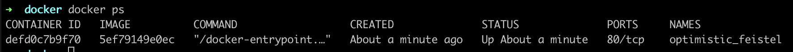
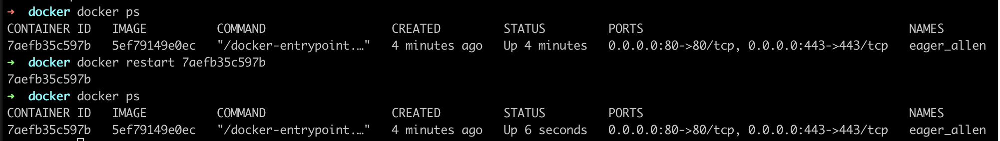
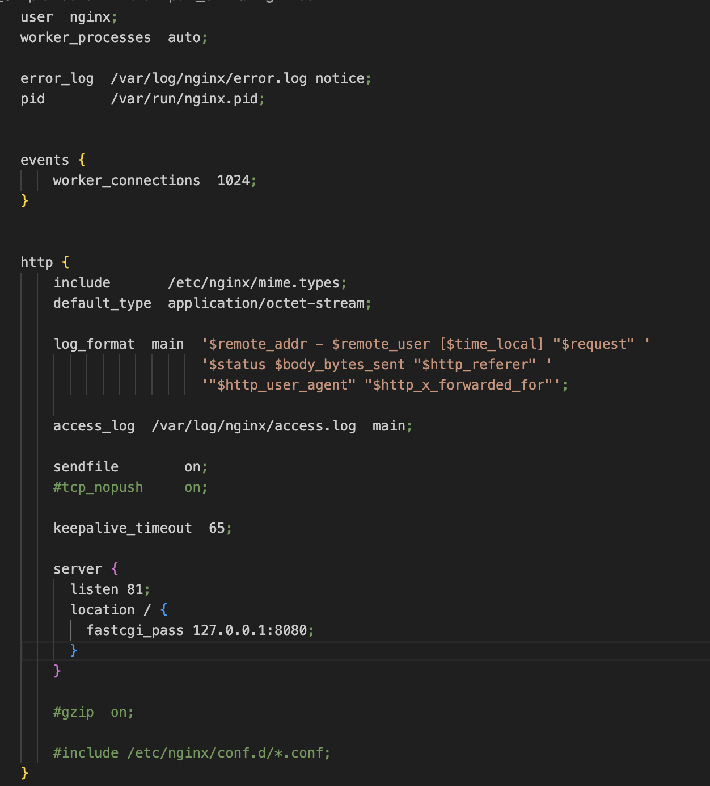
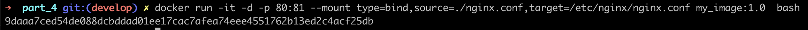
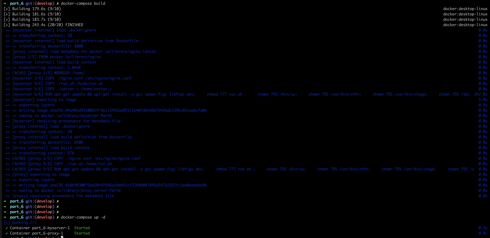

## Introduction 

## nginx

**nginx** (произносится как «engine-x») — это обратный прокси-сервер с открытым исходным кодом для протоколов HTTP, HTTPS и т. д.
nginx также используется, как балансировщик нагрузки, веб-сервер и для кеширования HTTP.
В проекте nginx уделяется особое внимание высокому параллелизму, высокой производительности и низкому использованию памяти.
У nginx есть один главный и несколько рабочих процессов.
Основная задача главного процесса — чтение и проверка конфигурации и управление рабочими процессами.
Рабочие процессы выполняют фактическую обработку запросов.
Как работают nginx и его модули, определяется в конфигурационном файле. По умолчанию конфигурационный файл называется nginx.conf.

## Docker

Контейнер – новый «исполняемый файл», включающий в себя все необходимые продукту зависимости. 
Главное преимущество контейнеризации – изоляция зависимостей и единая простая точка запуска ПО.
Основные понятия:

Докер-образ – «упаковка» для приложения и зависимостей (в том числе системных).
Контейнер – экземпляр образа, то есть «оживший» образ.

**Docker** — это платформа, которая предназначена для разработки, развёртывания и запуска приложений в контейнерах.
Docker – «де-факто» стандарт инструмента контейнеризации в индустрии, но он не является первым или последним среди технологий контейнеризации.
Предшественниками контейнеров Docker были виртуальные машины.
Виртуальная машина, как и контейнер, изолирует приложение и его зависимости от внешней среды.
Однако контейнеры Docker обладают преимуществами перед виртуальными машинами.
Так, они потребляют меньше ресурсов, их очень легко переносить, они быстрее запускаются и приходят в работоспособное состояние.
Докер-образ состоит из слоев. Каждый слой описывает какое-то изменение, которое должно быть выполнено с данными на запущенном контейнере.
Структура связей между слоями — иерархическая. Имеется базовый слой, на который «накладываются» остальные слои.
Для создания образа используется Dockerfile. Каждая инструкция в нем создает новый слой.

## Dockle

**Dockle** — это инструмент для проверки безопасности образов контейнеров, который можно использовать для поиска уязвимостей.
Основные функции и преимущества Dockle:

поиск уязвимостей в образах;
помощь в создании правильного Dockerfile;
простота в использовании, нужно указать только имя образа;
поддержка CIS Benchmarks.


## Docker Compose

**Docker Compose** — это инструментальное средство, которое предназначено для решения задач, связанных с развёртыванием проектов.
Docker Compose может пригодиться, если для обеспечения функционирования проекта используется несколько сервисов.
Docker Compose используется для одновременного управления несколькими контейнерами, входящими в состав приложения.
Этот инструмент предлагает те же возможности, что и Docker, но позволяет работать с более сложными распределенными приложениями, например микросервисными.

## Part 1. Готовый докер

##### Возьмем официальный докер-образ с **nginx** и выкачаем его при помощи `docker pull`.


##### Проверим наличие докер-образа через `docker images`.


##### Запустим докер-образ через `docker run -d [image_id|repository]`.


Флаг -d (сокращение от --detach) означает запуск контейнера в фоновом режиме (detached mode)

##### Проверим, что образ запустился через `docker ps`.


##### Посмотрим информацию о контейнере через `docker inspect [container_id|container_name]`.


##### По выводу команды определим и поместим в отчёт:
Размер контейнера:

```ShmSize``` использует оперативную память для хранения контейнеров в байтах. По умолчанию контейнер занимает ~ 64 МБ. 


Cписок замапленных портов:


Используя -A 3, мы захватываем 3 строки после строки с Ports, чтобы увидеть все детали о замапленных портах. Количество строк (-A 3) выбрано, чтобы захватить минимальное количество строк, включающих в себя основные детали о портах.

PublishAllPorts - Этот параметр указывает, что опция --publish-all (или сокращённо -P) не была использована при запуске контейнера. В данном случае значение false, это значит, что порты контейнера не будут автоматически мапплены на порты хоста.

ExposedPorts - декларация о том, какие порты контейнер использует и готов к ним принимать подключения. Однако это не означает, что эти порты автоматически мапплены на порты хоста; это просто сигнал другим службам Docker, что эти порты активны и могут быть использованы. На скрине выше порт 80/tcp объявлен как экспонированный, но, если опции -p (publish) или -P (publish all) не использованы, этот порт не будет доступен из вне.

Ports - этот ключ предоставляет информацию о том, какие порты контейнера сопоставлены (мапплены) с портами хоста. *"80/tcp": null* указывает на то, что порт 80/tcp контейнера не мапплен на какой-либо порт хоста. Здесь значение null обозначает отсутствие сопоставления.


IP контейнера: IP-адрес контейнера - это адрес, по которому контейнер доступен извне.


IP-адрес: 172.17.0.2

Значение -A 10 выбрано, чтобы охватить типичный случай, где 10 строк достаточно для отображения всей информации о сети контейнера, включая его IP-адрес.

##### Остановим докер образ через `docker stop [container_id|container_name]`.


##### Проверим, что образ остановился через `docker ps`.


##### Запустим докер с портами 80 и 443 в контейнере, замапленными на такие же порты на локальной машине, через команду *run*.

```docker run -d -p 80:80 -p 443:443 5ef79149e0ec```


##### Проверим, что в браузере по адресу *localhost:80* доступна стартовая страница **nginx**.


##### Перезапустим докер контейнер через `docker restart [container_id|container_name]`.

##### Проверим любым способом, что контейнер запустился.



## Part 2. Операции с контейнером

Разбираемся в конфигурации **nginx** и отображаем статус страницы.


##### Прочитаем конфигурационный файл *nginx.conf* внутри докер контейнера через команду *exec*.


##### Создадим на локальной машине файл *nginx.conf*.


##### Настроим в нем по пути */status* отдачу страницы статуса сервера **nginx**.


##### Скопируем созданный файл *nginx.conf* внутрь докер-образа через команду `docker cp`.


##### Перезапустим **nginx** внутри докер-образа через команду *exec*.


`nginx -t` - проверка конфигурацию nginx на наличие ошибок при помощи

Далее применяем команду nginx -s reload, чтобы применить последние изменения.


##### Проверим, что по адресу *localhost:80/status* отдается страничка со статусом сервера **nginx**.


##### Экспортируем контейнер в файл *container.tar* через команду *export*.


##### Остановим контейнер.


##### Удалим образ через `docker rmi [image_id|repository]`, не удаляя перед этим контейнеры.


флаг -f (или --force) используется для принудительного удаления указанного Docker-образа.
без флага -f Ошибка при использовании образа: Если образ, который вы пытаетесь удалить, все еще используется запущенными или остановленными контейнерами, Docker выдаст ошибку и не удалит образ.

##### Удаляем остановленный контейнер.


##### Импортируем контейнер обратно через команду *import*.


##### Запустим импортированный контейнер.


-g: Этот флаг позволяет передать Nginx глобальные директивы конфигурации из командной строки, вместо использования конфигурационного файла. Эти директивы будут применяться перед чтением основного конфигурационного файла.

'daemon off;' - глобальная директива, передаваемая Nginx. Она указывает серверу работать в не демонизированном режиме. В нормальных условиях, когда Nginx запускается, он работает в фоновом режиме (демонизируется). С этой директивой он остается запущенным на переднем плане.

В контейнерных средах, таких как Docker, процессы часто работают на переднем плане, потому что контейнер считается активным и работающим до тех пор, пока активен его главный процесс. Если главный процесс завершает работу, контейнер автоматически останавливается.
При использовании nginx -g 'daemon off;', Nginx остается на переднем плане и таким образом поддерживает работу контейнера.

Запуск на переднем плане упрощает логирование, поскольку все логи и вывод будут сразу видны в терминале или системном журнале контейнера.
Это также позволяет системе управления контейнерами (например, Docker) легко управлять Nginx и отслеживать его состояние.

##### Проверим, что по адресу *localhost:80/status* отдается страничка со статусом сервера **nginx**.


## Part 3. Мини веб-сервер

Напишем свой сервер.


##### Напишем мини-сервер на **C** и **FastCgi**, который будет возвращать простейшую страничку с надписью `Hello World!`.


Запускаем контейнер


Копируем файл server.c в контейнер.


Cкачиваем необходимые утилиты с помощью следующих команд:

* docker exec ebe17dfc1e34 apt-get update

* docker exec ebe17dfc1e34 apt-get install -y libfcgi-dev

* docker exec ebe17dfc1e34 apt-get install spawn-fcgi

* docker exec ebe17dfc1e34 apt-get -y install gcc

##### Запустим написанный мини-сервер через *spawn-fcgi* на порту 8080.

`spawn-fcgi` — это утилита, которая запускает FastCGI-приложения и связывает их с указанным сокетом или портом. Эта утилита часто используется для запуска FastCGI-приложений в окружениях, где веб-серверы, такие как Nginx или Lighttpd, не поддерживают запуск FastCGI-приложений напрямую.


##### Напишем свой *nginx.conf*, который будет проксировать все запросы с 81 порта на *127.0.0.1:8080*.



Копируем nginx.conf в контейнер


##### Проверим, что в браузере по *localhost:81* отдается написанная страничка.


## Part 4. Свой докер

Напишем свой докер-образ, который:
1) собирает исходники мини сервера на FastCgi из [Части 3](#part-3-мини-веб-сервер);
2) запускает его на 8080 порту;
3) копирует внутрь образа написанный *./nginx/nginx.conf*;
4) запускает **nginx**.
_**nginx** можно установить внутрь докера самостоятельно, а можно воспользоваться готовым образом с **nginx**'ом, как базовым.


Напишем скрипт run.sh для запуска процессов fcgi и nginx


Докер образ. `FROM nginx`: образ собирается на основе готового nginx


##### Соберем написанный докер-образ через `docker build` при этом указав имя и тег.

Если при создании образа не указывать тег, Docker по умолчанию присваивает тег latest

`docker build -t my_image .` ==  `docker build -t my_image:latest .`


##### Проверим через `docker images`, что все собралось корректно.


##### Запустим собранный докер-образ с маппингом 81 порта на 80 на локальной машине и маппингом папки *./nginx* внутрь контейнера по адресу, где лежат конфигурационные файлы **nginx**'а (см. [Часть 2](#part-2-операции-с-контейнером)).

``docker run -it -d -p 80:81 --mount type=bind,source=./nginx.conf,target=/etc/nginx/nginx.conf my_image:1.0 bash ``



##### Проверим, что по localhost:80 доступна страничка написанного мини сервера.


##### Допишем в *./nginx/nginx.conf* проксирование странички */status*, по которой надо отдавать статус сервера **nginx**.


##### Перезапустим докер-образ.


##### Проверим, что теперь по *localhost:80/status* отдается страничка со статусом **nginx**


## Part 5. **Dockle**

После написания образа проверим его на безопасность.


Устанавливаем dockle при помощи homebrew:
```
brew install goodwithtech/r/dockle
```

Далее создаем файл: `docker save my_image:1.0 > my_image1.tar и сканируем: dockle --input my_image1.tar`

##### Просканируем образ из предыдущего задания через `dockle [image_id|repository]` с помощью команды:


Исправим образ так, чтобы при проверке через dockle не было ошибок и предупреждений.

#### Первая фатальная ошибка ------------
Первая фатальная ошибка возникает из-за того, что в Dockerfile образа Docker были обнаружены переменные окружения, которые содержат чувствительные данные, такие как ключи или пароли. В данном случае, Dockle обнаружил, что переменная окружения NGINX_GPGKEYS содержит GPG ключи.

Мы можем исключить эту ошибку следующим образом:
1) создаем файл: `docker save my_image:2.0 > my_image2.tar`. 
2) Сканируем образ с помощью Dockle: `dockle -ak NGINX_GPGKEYS -ak NGINX_GPGKEY_PATH --input my_image2.tar`

Элементы команды dockle -ak NGINX_GPGKEYS -ak NGINX_GPGKEY_PATH --input my_image1.tar означают следующее:

* -ak NGINX_GPGKEYS: Исключает проверку на наличие переменной окружения NGINX_GPGKEYS при анализе образа Docker. Это позволяет Dockle игнорировать предупреждения об использовании этой переменной.
* -ak NGINX_GPGKEY_PATH: Аналогично, исключает проверку на наличие переменной окружения NGINX_GPGKEY_PATH.
* --input my_image2.tar: Указывает Dockle на использование архива my_image1.tar в качестве входного образа для анализа.
Использование -ak полезно, когда вы уверены, что исключение определённых проверок безопасности для конкретных переменных окружения оправдано. Однако в большинстве случаев рекомендуется избегать хранения чувствительных данных в переменных окружения.

#### Вторая фатальная ошибка и warn ----------------
* Вносим изменения в Докер файле, добавляя healthcare и пользователя


Добавляем в наш Dockerfile:
```
HEALTHCHECK --interval=30s --timeout=10s --start-period=5s --retries=3 CMD [ "curl", "--fail", "http://localhost:81" ]
```
`--interval=30s` - интервал между проверками состояния (30 сек);

`--timeout=10s` - проверка работоспособности, которая запускает период ожидания. Считается проверка работоспособности неудачной, если время превышено;

`--start-period=5s` - определяет, сколько времени потребуется контейнеру для загрузки;

`--retries=3` - количество попыток, которые после сбоев пытаются "поднять" контейнер. После достижения максимального количество (3 раза) статус контейнера считается неработоспособным.

`CMD [ "curl", "--fail", "http://localhost:81" ]` выполняет HTTP-запрос к серверу на порту 81. 
`--fail` означает, что завершится с ошибкой, если получают ошибку 404 или 500. 


##### Исправим образ так, чтобы при проверке через **dockle** не было ошибок и предупреждений.

* Проверяем: 


## Part 6. Базовый **Docker Compose**


##### Напишем файл *docker-compose.yml*, с помощью которого:
1) Поднимем докер-контейнер из [Части 5](#part-5-инструмент-dockle) _(он должен работать в локальной сети, т. е. не нужно использовать инструкцию **EXPOSE** и мапить порты на локальную машину)_.
2) Поднимем докер-контейнер с **nginx**, который будет проксировать все запросы с 8080 порта на 81 порт первого контейнера.
##### Замаппим 8080 порт второго контейнера на 80 порт локальной машины.


- services: Определяет список сервисов, каждый из которых может иметь свои настройки.
Для каждого сервиса вы можете указать:

- image: Образ, который будет использован для создания контейнера.

- ports: Определяет проброс портов.

- build: указание на необходимость сборки из Dockerfile.

- depends_on: Свойство используется для указания порядка запуска служб.

- volumes: список томов, которые будут подключены к контейнеру.

##### Остановим все запущенные контейнеры.


##### Соберем и запустим проект с помощью команд `docker-compose build` и `docker-compose up`.



##### Проверим, что в браузере по *localhost:80* отдается написанная страничка, как и ранее.

